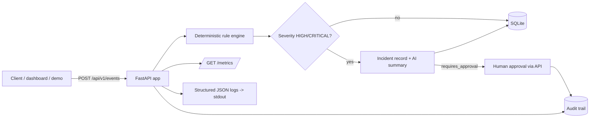

# Azure DevOps Operations POC

> Azure DevOps Operations POC is a personal technical reference project for understanding how
> Azure DevOps Pipelines, ACR, AKS, Key Vault, Azure Monitor, Log Analytics, Application
> Insights, Terraform, and operational approval flows connect in a small end-to-end system.

It is a small, runnable application, plus a proposed (never deployed) Azure architecture around
it. The app turns deployment/infrastructure events (a failed deployment, a pod crash-looping, a
readiness probe failure, ...) into a deterministic, explainable risk assessment, and requires a
recorded human decision before anything resembling a rollback or scale action would happen.

## Why This Repository Exists

Built to establish foundational Azure familiarity - mapping existing AWS, GCP, Docker,
Kubernetes, Terraform, CI/CD, and monitoring knowledge onto the equivalent Azure services - and
to leave a working reference to revisit the next time Azure comes up in a real engagement. It is
not a demonstration of production Azure experience or a flagship portfolio piece.

## What it does

- Validates and scores operational events with a small, deterministic rule engine (fixed,
  configurable weights - no ML, no hidden heuristics).
- Opens an incident when severity reaches HIGH/CRITICAL, and requires a recorded human approval
  before a rollback/scale/suspend recommendation is considered authorized. The app never executes
  the action itself.
- Records a full audit trail, exposes Prometheus-style metrics, and logs structured JSON.
- Includes an optional, clearly-labeled AI incident-summary stub (off by default, safe fallback
  on any failure) - not a core feature.
- Ships a proposed (unapplied) Azure architecture in Terraform, an AKS deployment configuration,
  a GitHub Actions workflow, and an Azure DevOps pipeline definition.

## Architecture



Details: [docs/ARCHITECTURE.md](docs/ARCHITECTURE.md) (modules, request flow, OOP decisions) and
[docs/AZURE_ARCHITECTURE.md](docs/AZURE_ARCHITECTURE.md) (the proposed Azure deployment).

## Configure and run

Requires Python 3.12+.

```bash
python -m venv .venv
source .venv/bin/activate   # .venv\Scripts\activate on Windows
pip install -r requirements-dev.txt
uvicorn app.main:app --reload
```

Runs with zero configuration: a local SQLite file (`./data/app.db`), the deterministic rule
engine, and a deterministic (non-AI) incident assistant. No Azure credentials, subscription, or
network access are required. Copy `.env.example` to `.env` to override any setting.

**Docker:**

```bash
docker compose up --build
```

Builds the image, starts the container with a health check on `GET /health`, and persists the
SQLite database in a named volume. If the build fails with a certificate/TLS error, see
[Docker build fails with a certificate error](#docker-build-fails-with-a-certificate-error) below.

## Access the app

| What | URL |
|---|---|
| **Dashboard** (local demonstration UI) | `http://localhost:8000/` |
| Swagger UI | `http://localhost:8000/docs` |
| ReDoc | `http://localhost:8000/redoc` |
| Health / readiness / metrics | `/health`, `/ready`, `/metrics` |

The dashboard is a minimal, server-rendered **local demonstration** page - one button ("Run MOCK
Demo") that calls the same `POST /api/v1/demo/run` and `GET /api/v1/audit` endpoints described
below, and renders whatever they return. It has no logic of its own, no authentication, and
creates or modifies nothing in Azure. See [docs/DEMO.md](docs/DEMO.md) for the full walkthrough.

**Run the demo** (deterministic, offline incident lifecycle - failure, escalation, approval,
rollback, recovery): click "Run MOCK Demo" on the dashboard, or:

```bash
curl -X POST http://localhost:8000/api/v1/demo/run
```

**Everyday API usage:**

```bash
curl -X POST http://localhost:8000/api/v1/events \
  -H "Content-Type: application/json" \
  -d '{"event_type": "deployment_failed", "source": "checkout-service", "payload": {}}'

curl http://localhost:8000/api/v1/events
curl -X POST http://localhost:8000/api/v1/incidents/<incident_id>/approve \
  -H "Content-Type: application/json" -d '{"actor": "you", "reason": "confirmed"}'
curl http://localhost:8000/api/v1/audit
```

## Testing

```bash
pytest -q                          # unit, integration, and e2e tests
ruff check app tests               # lint
ruff format --check app tests      # format check
```

See [docs/TESTING.md](docs/TESTING.md) for what each layer covers.

## CI/CD

- **GitHub Actions** (`.github/workflows/ci.yml`): lint, tests, Docker build, Terraform
  format/validate, Kubernetes manifest check - runs on every push/PR to `main`.
- **Azure DevOps** (`pipelines/azure-pipelines.yml`): the same validation, plus an illustrative,
  disabled-by-default ACR push and AKS deploy stage gated behind an Environment approval.

Details: [docs/CI_CD.md](docs/CI_CD.md).

## Docker build fails with a certificate error

On some Windows machines - especially with corporate networking, a VPN, or antivirus/endpoint
security software installed - `docker build` can fail while installing packages, with errors
mentioning certificate verification, a TLS handshake failure, or an "unknown authority." This is
normally a **local network/certificate-trust issue**, not a defect in this project's `Dockerfile`
or application.

Prefer installing the correct trusted CA certificate, configuring Docker's proxy settings, or
excluding Docker Desktop from your security software's traffic inspection, over any workaround
that disables TLS verification - globally disabling certificate validation is **not
recommended** and is not something this project supports or requires. Full guidance, including a
scoped, temporary, local-development-only fallback technique that avoids the container making any
HTTPS call at all: [docs/DOCKER_TLS_TROUBLESHOOTING.md](docs/DOCKER_TLS_TROUBLESHOOTING.md).

## Safety and cost

- **No Azure resource has been created.** `terraform apply` has never been run.
- **No cloud cost has been incurred.** Everything in this repository runs locally.
- Applying `infra/terraform` yourself would create billable resources. See
  [docs/SECURITY_AND_COST.md](docs/SECURITY_AND_COST.md) before doing so.

## Scope and limitations

This is a personal reference POC, not a production system or a claim of production Azure
experience or specialization:

- The rule engine uses fixed, configurable additive weights - not a learned/adaptive model.
- The optional AI incident assistant is a small illustrative stub, not a production integration.
- SQLite is a POC choice, not a recommendation for a real multi-instance deployment.
- The Azure infrastructure is a *proposed* architecture, validated for syntax/formatting only -
  never proven against a live subscription.
- The dashboard is a local demonstration layer, not an operations portal.

## Documentation

| Document | Covers |
|---|---|
| [docs/ARCHITECTURE.md](docs/ARCHITECTURE.md) | Modules, request/event flow, OOP decisions |
| [docs/AZURE_ARCHITECTURE.md](docs/AZURE_ARCHITECTURE.md) | The proposed Azure deployment |
| [docs/AZURE_GLOSSARY.md](docs/AZURE_GLOSSARY.md) | Plain explanations of the Azure terms used here |
| [docs/CLOUD_SERVICE_MAPPING.md](docs/CLOUD_SERVICE_MAPPING.md) | Azure -> AWS/GCP service equivalents |
| [docs/CI_CD.md](docs/CI_CD.md) | Pipeline stages, approval gates, rollback flow |
| [docs/OPERATIONS_RUNBOOK.md](docs/OPERATIONS_RUNBOOK.md) | Health checks, incident investigation, rollback/recovery steps |
| [docs/TESTING.md](docs/TESTING.md) | Test strategy and coverage per layer |
| [docs/SECURITY_AND_COST.md](docs/SECURITY_AND_COST.md) | Secrets, least privilege, RBAC, cost drivers |
| [docs/DEMO.md](docs/DEMO.md) | The demo story, dashboard walkthrough, and what it proves |
| [docs/DOCKER_TLS_TROUBLESHOOTING.md](docs/DOCKER_TLS_TROUBLESHOOTING.md) | Docker build certificate/TLS errors |
