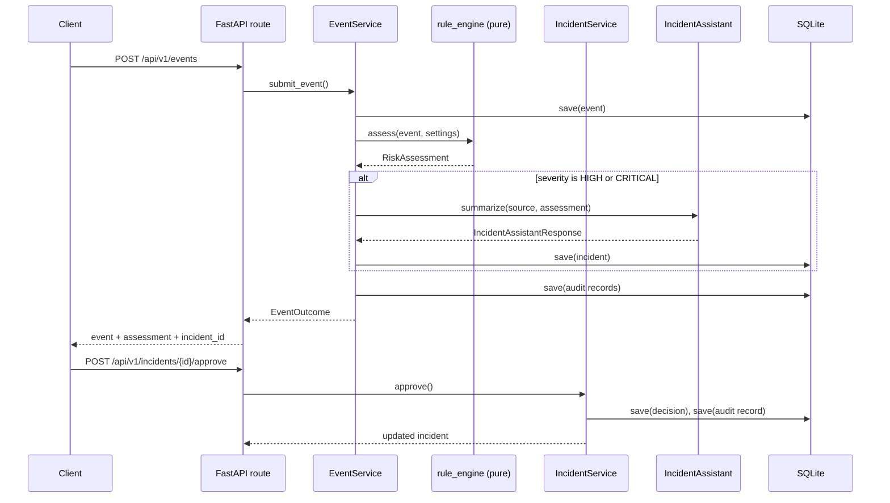

# Architecture

## Module responsibilities

```
app/
  api/            FastAPI routers (incl. the dashboard route), request/response schemas,
                  middleware, DI accessors
  core/           config, structured logging, correlation IDs, DI container, domain exceptions
  domain/         the deterministic rule engine (pure functions, no I/O)
  models/         Pydantic domain models: events, assessments, incidents, audit records, AI schema
  services/       orchestration: event flow, approval flow, demo scenario, audit recording
  repositories/   storage abstractions + a SQLite implementation
  integrations/   the optional incident assistant (deterministic + illustrative Azure OpenAI stub)
  monitoring/     Prometheus metrics
  templates/      one Jinja2 template for the local demonstration dashboard (no other UI layer)
  main.py         app assembly
```

The dashboard (`app/api/routes/dashboard.py` + `app/templates/dashboard.html`) is a presentation-only
addition: it renders one page at `/` and calls the existing `/api/v1/demo/run` and
`/api/v1/audit` endpoints from client-side JavaScript. It holds no business logic and does not
change the dependency boundaries below.

Each layer only depends on the layers below it: `api` depends on `services`, `services` depend on
`domain` + `repositories` + `integrations`, and `domain`/`models` depend on nothing else in the
app. This is the main thing enforced by hand (there is no dependency-injection framework or
import-linter) - it is simple enough to hold by convention at this size.

## Request and event flow



## OOP decisions

- **`IncidentAssistant` is an abstract base class** (`app/integrations/ai_assistant.py`) with two
  concrete implementations (deterministic, illustrative Azure OpenAI) and a `FallbackIncidentAssistant`
  decorator that wraps a primary assistant with a safe fallback. This is the one place in the
  project where an ABC earns its keep: it is the seam a real Azure OpenAI integration would plug
  into without touching `EventService`.
- **Repository interfaces are ABCs** (`app/repositories/base.py`) with a SQLite implementation.
  This is what lets `tests/unit/test_event_service.py` swap in a repository that raises, to test
  a failure path, without touching a database.
- **The rule engine is not a class at all.** It is a module of small pure functions plus one
  `assess()` entry point. There is only ever one rule engine, it holds no state, and every rule
  is independently unit-testable - a class would add indirection without buying anything.
- **Everything else is a plain service class with constructor-injected dependencies** (no DI
  framework). `app/core/container.py` builds the object graph once, in one place.

## Dependency boundaries

- `domain/rule_engine.py` takes no repository, service, or I/O dependency - it is a pure function
  of `(OperationalEvent, Settings) -> RiskAssessment`. This is what makes the assessment logic
  fully unit-testable without a database or an HTTP client.
- `services/` never imports from `api/` - services are usable directly (the demo endpoint and
  the E2E test both exercise them through the API, but nothing stops a script from calling
  `EventService.submit_event()` directly).
- `integrations/ai_assistant.py` never has access to anything that could mutate infrastructure -
  it only ever returns a summary and a list of strings, validated by
  `IncidentAssistantResponse`.

## Why SQLite, not PostgreSQL

A POC that needs to run with zero setup and be trivially inspectable (`sqlite3 data/app.db`)
does not benefit from a second service, connection pool, and container to operate. The
repository interfaces in `app/repositories/base.py` are the seam where a PostgreSQL
implementation could be added later without touching any service or route.

## Local versus Azure execution

| Concern | Local (this repo, as run) | Azure (if deployed) |
|---|---|---|
| Compute | `uvicorn` process, or a single Docker container | AKS pods behind a Service |
| Image storage | local Docker daemon | Azure Container Registry |
| Persistence | SQLite file | unchanged in this POC; a real deployment would revisit this |
| Logs | JSON lines to stdout | same JSON lines, collected by AKS Container Insights into Log Analytics |
| Metrics | `GET /metrics` scraped manually or by local Prometheus | scraped by Azure Monitor managed Prometheus |
| Secrets | `.env` file (never committed) | Key Vault, read via managed identity |
| Identity | none needed | AKS system-assigned identity (ACR pull) + a workload identity (Key Vault) |

Nothing in the application code changes between these two columns - the same container image and
the same `/health`, `/ready`, `/metrics` endpoints are what make that possible.
