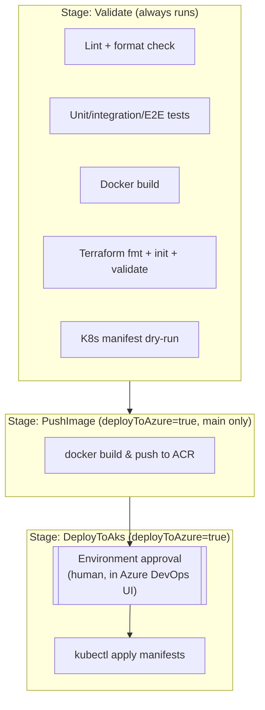

# CI/CD

## GitHub Actions validation flow (`.github/workflows/ci.yml`)

Runs on every push and pull request to `main`. No Azure credentials, no secrets, nothing that can
incur cost:

## Azure DevOps pipeline stages (`pipelines/azure-pipelines.yml`)

Three safety properties are load-bearing here, not incidental:

1. **`deployToAzure` defaults to `false`.** The pipeline parameter has to be explicitly set to
   `true` to reach the `PushImage`/`DeployToAks` stages at all.
2. **`DeployToAks` targets an Azure DevOps *Environment*** (`aks-dev`), and Environments carry
   their own approvals/checks configured in the Azure DevOps UI (Project Settings > Environments
   > aks-dev > Approvals and checks) - not in this YAML file. A run cannot reach the deploy step
   without a human clicking approve there.
3. **A pull request can never deploy.** `PushImage`'s condition requires
   `Build.SourceBranch == refs/heads/main`.

## Image promotion

The same image, tagged with the pipeline's `Build.BuildId` (and `latest`), is what gets pushed to
ACR and later referenced by `infra/kubernetes/deployment.yaml`'s `containers` override in the
`KubernetesManifest@1` task - there is no separate "promote to prod" registry or retag step in
this POC; a real multi-environment setup would typically add one.

## Approval gates

- **Azure DevOps Environment approval** before `DeployToAks` (see above).
- **Human approval via the application's own API** (`POST /api/v1/incidents/{id}/approve`) before
  any *operational* action the app recommends (rollback, scale, suspend) would be considered
  authorized - this is a separate, application-level gate from the pipeline's deployment gate,
  and the application never executes the action itself either way.

## Rollback flow

- **Pipeline/deployment rollback**: `kubectl rollout undo deployment/adops-poc -n adops-poc`
  (see `infra/kubernetes/README.md`). Kept possible by `revisionHistoryLimit: 3` on the
  Deployment.
- **Operational rollback** (the thing the rule engine recommends after a CRITICAL assessment):
  recorded as a human decision through the API; the demo scenario
  (`POST /api/v1/demo/run`) walks through exactly this, ending in a `rollback_completed` event
  and a resolved incident. See [DEMO.md](DEMO.md).

## Credentials and service connections a real deployment would need

None of these are created by this project. They are documented here so it's clear what *would*
be required if someone wired the deployment stages up for real:

| Name (as referenced in the pipeline) | Type | Purpose | Suggested scope |
|---|---|---|---|
| `acr-service-connection` | Docker Registry service connection (backed by a Entra ID service principal or workload identity federation) | Push images to ACR | `AcrPush` on the one ACR resource |
| `aks-service-connection` | Kubernetes service connection | Apply manifests to AKS | Scoped to the `adops-poc` namespace if possible, not cluster-admin |

Both would be created manually in Azure DevOps (Project Settings > Service connections) - never
by pipeline code, and never checked into this repository.
