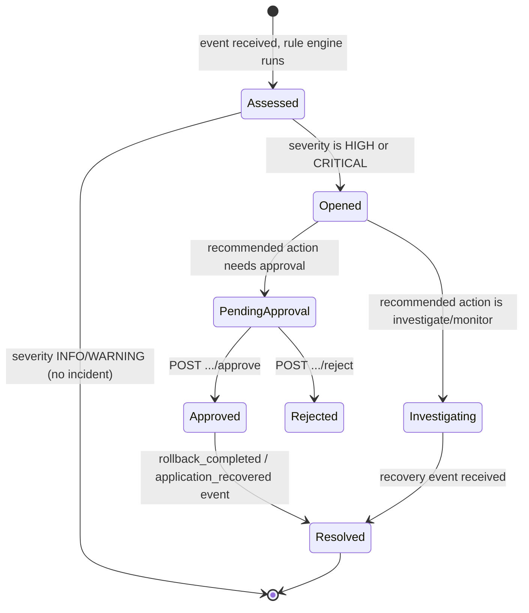

# Operations Runbook

Practical steps for operating this application, written the way a runbook for a real service
would read, scoped to what this POC actually does.

## Health and readiness checks

- `GET /health` - liveness only. Returns `200 {"status": "ok"}` whenever the process is up; does
  not check the database. In AKS this maps to the Deployment's `livenessProbe`.
- `GET /ready` - readiness. Opens a database connection and runs `SELECT 1`. Returns `503` if
  that fails. In AKS this maps to the `readinessProbe`, which gates whether the Service sends
  traffic to a pod.

```bash
curl -i http://localhost:8000/health
curl -i http://localhost:8000/ready
```

## Incident lifecycle and approval



## Common investigation scenarios

### Failed deployment

1. Submit or observe a `deployment_failed` event for the affected `source`.
2. `GET /api/v1/events?limit=50` to see recent events for context, or filter by correlation ID
   via `GET /api/v1/audit?correlation_id=<id>` if you have one from the original request.
3. Check the resulting assessment's `explanation` and `triggered_rules` - this is the
   authoritative account of *why* the system flagged it, since the rule engine is deterministic
   (`app/domain/rule_engine.py`).
4. If an incident was opened, `GET /api/v1/incidents/{incident_id}` shows its current
   `approval_status` and the deterministic (or, if configured, AI) `ai_summary`.

### Unhealthy AKS workload (readiness failures, restart loops)

In this POC these arrive as `readiness_probe_failure` and `pod_restart_threshold_exceeded`
events. In a real AKS deployment, the equivalent first step is:

```bash
kubectl get pods -n adops-poc
kubectl describe pod <pod-name> -n adops-poc
kubectl logs <pod-name> -n adops-poc --previous   # logs from before the last restart
```

### Log investigation

Locally: the app logs structured JSON lines to stdout (`docker compose logs -f app`, or watch the
terminal running `uvicorn`). Every line carries a `correlation_id`, so grepping for one ID
reconstructs the full request/event trail:

```bash
docker compose logs app | grep '"correlation_id": "<id>"'
```

In AKS, the same JSON lines are collected by Container Insights into the Log Analytics workspace
(see [AZURE_ARCHITECTURE.md](AZURE_ARCHITECTURE.md)) and would be queried with KQL, e.g.:

```kusto
ContainerLogV2
| where LogMessage has "<correlation_id>"
| order by TimeGenerated asc
```

### Rollback process

1. Confirm the incident's recommended action is `rollback` and it is `PENDING`
   (`GET /api/v1/incidents/{id}`).
2. A human approves it: `POST /api/v1/incidents/{id}/approve` with `{"actor": "...", "reason":
   "..."}`. This only **records** the decision - the application never executes a rollback.
3. The actual rollback is performed out-of-band, e.g. `kubectl rollout undo
   deployment/adops-poc -n adops-poc` (see `infra/kubernetes/README.md`), or by re-running a
   pipeline against a previous image tag.
4. Submit (or observe) a `rollback_completed` event for the same `source`. This resolves the
   open incident (`resolved: true`).

### Recovery verification

1. Submit (or observe) an `application_recovered` event for the source.
2. `GET /api/v1/incidents/{incident_id}` should show `resolved: true`.
3. `GET /metrics` - `assessments_total{severity="info"}` should be incrementing again for that
   source, and `events_received_total` should reflect the recovery event.

## Escalation conditions

This POC has no paging/alerting integration - "escalation" here means: when should a human look
beyond what the API already shows.

- An incident stays `PENDING` with no decision recorded for longer than expected.
- `ai_fallback_total` (see `GET /metrics`) is climbing, meaning the optional AI path is
  configured but failing - check credentials/connectivity for the Azure OpenAI endpoint, or fall
  back to `APP_AI_PROVIDER=deterministic`.
- `errors_total` (labeled by path) is nonzero - something in the API is raising unhandled
  exceptions; check the structured logs for the matching `correlation_id`.
